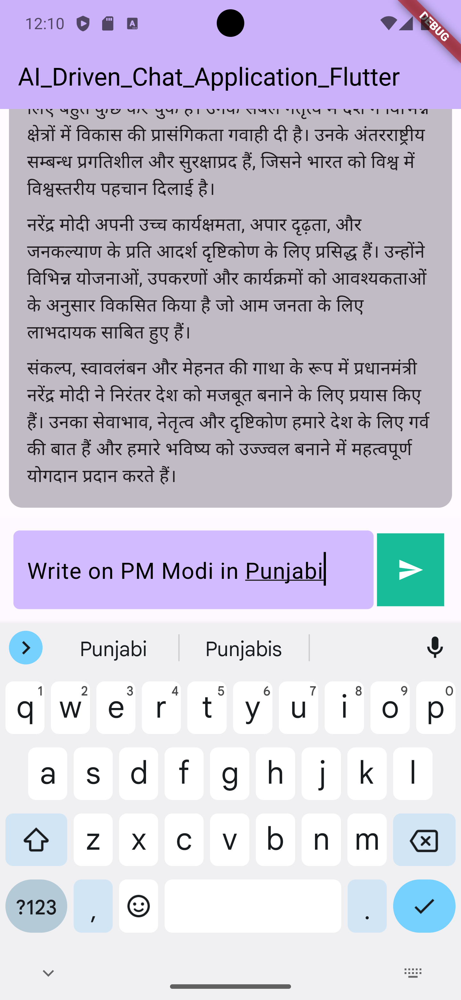

# ai_driven_chat_application_flutter

AI Driven Chat Application  

Flutter, Dart, ChatGPT API  

•  Developed a Flutter-based AI-driven chat application powered by ChatGPT. 
•  Able to understand user queries, ensuring accurate responses that enhance the user experience. 

## 📷 Previews

## Getting Started

This project is a starting point for a Flutter application.

A few resources to get you started if this is your first Flutter project:

For help getting started with Flutter development, view the
[online documentation](https://docs.flutter.dev/), which offers tutorials,
samples, guidance on mobile development, and a full API reference.
